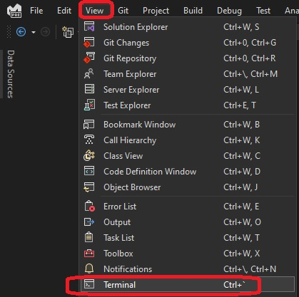
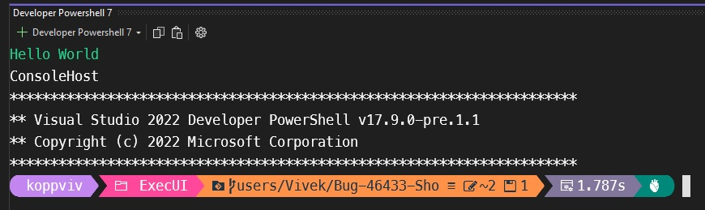
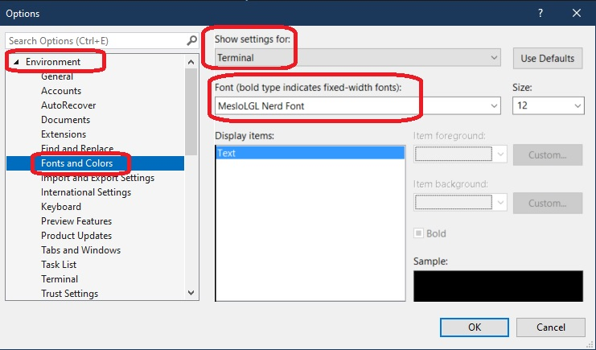

# Oh-My-Posh-Setup

Set up steps for oh my posh terminal prompt

## Installing windows terminal

## For Visual Studio Code, do this.

https://youtu.be/VT2L1SXFq9U?t=2021

## For Microsoft Visual Studio do the following.

To open terminal.

You have the terminal

Tool -> Options

## Fonts
1. https://ohmyposh.dev/docs/installation/fonts#installation
2. https://ohmyposh.dev/docs/installation/fonts#configuration

## References
1. Scott Hanselman Windows Terminal

2. https://www.youtube.com/watch?v=VT2L1SXFq9U

3. Take your Windows Terminal and PowerShell to the next level with Terminal Icons - Scott Hanselman's Blog
   1. https://www.hanselman.com/blog/take-your-windows-terminal-and-powershell-to-the-next-level-with-terminal-icons

4. https://youtu.be/OL9Mr4dzIWU?t=55

5. https://www.youtube.com/watch?v=FC-gLkYWXLw

6. https://stackoverflow.com/a/70536536/1977871

7. https://learn.microsoft.com/en-us/windows/terminal/tutorials/custom-prompt-setup

